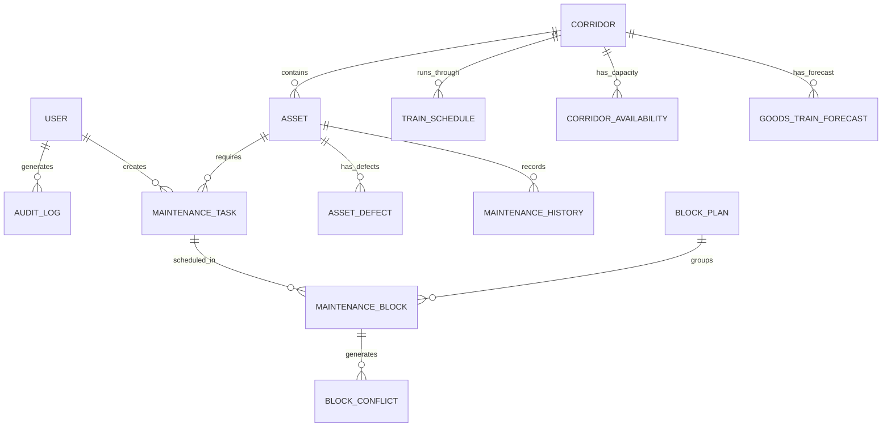

# Architecture & Implementation Plan: AI-Powered Automatic Block Planning System (SIH26027)

## Executive Summary
This document specifies the end-to-end architecture, database schema, API design, mathematical optimization strategy, and phase-by-phase implementation plan for the **AI-Powered Automatic Block Planning System** for Indian Railways (Problem Statement **SIH26027**).

The core mission of this system is to transform decentralized, manual railway maintenance planning (across Track/Engineering, Traction Distribution/OHE, and Signal & Telecommunication) into a unified, AI-driven, multi-objective optimized block scheduling engine. The system integrates maintenance records, asset defects, corridor capacity, passenger/freight train timetables, and generates weekly/monthly block plans that maximize asset availability while minimizing train operation disruptions.

---

## 1. System Architecture

```
                                +----------------------------------+
                                |      React + TypeScript UI       |
                                | (Tailwind CSS, Recharts, Canvas) |
                                +----------------------------------+
                                                 |
                                                 | REST / HTTP JSON
                                                 v
                                +----------------------------------+
                                |       Node.js / Express API      |
                                |  (TypeScript, Prisma ORM, JWT)   |
                                +----------------------------------+
                                       /                    \
                     SQL / Prisma     /                      \ HTTP REST API (JSON)
                                     v                        v
                        +----------------------+    +------------------------------------+
                        | PostgreSQL / SQLite  |    |     Python Optimization Service    |
                        | (Assets, Tasks, Logs)|    | (FastAPI, PuLP / SciPy / NetworkX) |
                        +----------------------+    +------------------------------------+
                                                              |
                                                              v
                                                   +----------------------+
                                                   | Block Planning Engine|
                                                   | (MILP / Heuristic)   |
                                                   +----------------------+
```

### Component Breakdown
1. **Frontend (`frontend/`)**: React + TypeScript + Vite + Tailwind CSS. Provides a control-room grade operations interface with dark/light themes, interactive corridor map visualization, Gantt chart block calendars, what-if simulators, and optimization comparison views.
2. **Backend Gateway (`backend/`)**: Node.js + Express + TypeScript. Handles authentication (JWT), RBAC, CRUD for assets, defects, tasks, timetables, block plans, audit logs, and coordinates requests with the Python Optimization Service.
3. **Optimization / AI Service (`ai_service/`)**: Python 3.11 + FastAPI. Houses the core mathematical optimization solver, multi-department joint-block coordination logic, 8-tier conflict detection engine, and predictive risk scoring modules.
4. **Database Storage**: PostgreSQL (with PostGIS support) / SQLite via Prisma ORM for seamless environment setup and zero-config local execution.

---

## 2. User Roles & RBAC Matrix

| Feature / Action | ADMIN | OPERATIONS CONTROLLER | MAINTENANCE ENGINEER |
| :--- | :---: | :---: | :---: |
| User Management & System Config | ✅ | ❌ | ❌ |
| Configure Optimization Weights | ✅ | ❌ | ❌ |
| Create / Edit Maintenance Requests | ✅ | ❌ | ✅ |
| Report Defects & Resource Needs | ✅ | ❌ | ✅ |
| View Train Timetable & Goods Forecast | ✅ | ✅ | ✅ |
| Run Conflict Detection Engine | ✅ | ✅ | ✅ |
| Trigger Automatic Block Optimizer | ✅ | ✅ | ❌ |
| Approve / Modify / Reject Block Plans | ✅ | ✅ | ❌ |
| Run What-If Simulations | ✅ | ✅ | ✅ |
| Export Analytics & Audit Reports | ✅ | ✅ | ✅ |

---

## 3. Database Schema Design (Prisma / SQL)

The system manages 16 core relational models:



### Schema Summary:
1. **`User`**: `id`, `username`, `email`, `passwordHash`, `role` (ADMIN, OPERATIONS_CONTROLLER, MAINTENANCE_ENGINEER), `department` (ENG, TD, ST, OPS).
2. **`Asset`**: `id`, `assetCode`, `assetType` (TRACK, OHE_LINE, SIGNAL, TELECOM, SWITCH, CROSSING, BRIDGE), `department` (ENGINEERING, TRACTION_DISTRIBUTION, SIGNAL_TELECOM), `location`, `corridorId`, `criticality` (LOW, MEDIUM, HIGH, CRITICAL), `conditionScore` (0-100), `availability` (100%), `lastMaintenanceDate`, `nextDueDate`.
3. **`AssetDefect`**: `id`, `assetId`, `defectType`, `severity` (MINOR, MAJOR, SEVERE, CRITICAL), `reportedAt`, `isResolved`, `speedRestriction` (km/h limit if any).
4. **`MaintenanceTask`**: `id`, `taskId`, `assetId`, `department`, `maintenanceType` (PREVENTIVE, CORRECTIVE, DEFECT_RECTIFICATION, OVERHAUL), `description`, `priorityScore` (computed), `criticality`, `urgency` (computed from due date), `estimatedDurationMinutes`, `requiredResources` (JSON array: power-block, tower-wagon, tamper, gang-count), `preferredWindowStart`, `preferredWindowEnd`, `deadline`, `status` (PENDING, PRIORITIZED, SCHEDULED, APPROVED, ACTIVE, COMPLETED, CANCELLED).
5. **`MaintenanceHistory`**: `id`, `assetId`, `taskId`, `completedAt`, `downtimeMinutes`, `engineerInCharge`, `remarks`.
6. **`Train`**: `id`, `trainNumber`, `trainName`, `trainType` (PASSENGER, EXPRESS, SUPERFAST, FREIGHT), `priorityRank` (1 highest, 4 lowest).
7. **`TrainSchedule`**: `id`, `trainId`, `corridorId`, `origin`, `destination`, `arrivalTime`, `departureTime`, `dayOfWeek`, `isDaily`.
8. **`GoodsTrainForecast`**: `id`, `corridorId`, `forecastDate`, `timeSlot`, `expectedSlots`, `trafficLevel` (LOW, MEDIUM, HIGH, CRITICAL).
9. **`Corridor`**: `id`, `code` (e.g., C001, C002), `name` (e.g. NDLS-CNB Main Line), `startStation`, `endStation`, `lengthKm`, `totalTracks` (SINGLE, DOUBLE, QUAD).
10. **`CorridorAvailability`**: `id`, `corridorId`, `startTime`, `endTime`, `availabilityStatus` (AVAILABLE, BUSY, RESTRICTED), `trafficDensity`.
11. **`MaintenanceBlock`**: `id`, `planId`, `taskId`, `corridorId`, `scheduledStartTime`, `scheduledEndTime`, `durationMinutes`, `isJointBlock` (boolean), `coordinatingDepts` (JSON), `approvalStatus` (PROPOSED, APPROVED, MODIFIED, REJECTED).
12. **`BlockConflict`**: `id`, `blockId`, `conflictType` (TRAIN_VS_BLOCK, FREIGHT_VS_BLOCK, MAINT_VS_MAINT, RESOURCE, CORRIDOR, ASSET, TIME_WINDOW, EXISTING_BLOCK), `severity` (LOW, MEDIUM, HIGH, CRITICAL), `description`, `affectedEntityId`.
13. **`BlockPlan`**: `id`, `planName`, `horizonType` (WEEKLY, MONTHLY), `startDate`, `endDate`, `status` (DRAFT, OPTIMIZED, APPROVED, REJECTED), `totalScore`, `metrics` (JSON: delayMinutes, trainsAffected, assetDowntimeHours, utilizationPercent).
14. **`OptimizationWeight`**: `id`, `assetCriticalityWeight`, `maintenanceUrgencyWeight`, `trainImpactWeight`, `delayWeight`, `conflictWeight`, `assetDowntimeWeight`, `blockUtilizationWeight`, `isDefault`.
15. **`Notification`**: `id`, `userId`, `title`, `message`, `type` (DEFECT, CONFLICT, APPROVAL, SYSTEM), `isRead`, `createdAt`.
16. **`AuditLog`**: `id`, `userId`, `action`, `entityType`, `entityId`, `details` (JSON), `createdAt`.

---

## 4. Optimization Engine Formulation

The core innovation is a transparent, deterministic **Multi-Objective Weighted Constraint Optimization Engine** implemented in Python using mixed-integer scheduling rules and local optimization search (PuLP / SciPy / custom MILP heuristic).

### Objective Function:
$$\text{Maximize } \mathcal{Z} = w_1 \cdot S_{\text{criticality}} + w_2 \cdot S_{\text{urgency}} + w_3 \cdot S_{\text{utilization}} - w_4 \cdot C_{\text{train\_impact}} - w_5 \cdot C_{\text{delay}} - w_6 \cdot C_{\text{conflicts}} - w_7 \cdot C_{\text{downtime}}$$

Where:
- $S_{\text{criticality}}$ = Weighted sum of asset criticality of completed tasks.
- $S_{\text{urgency}}$ = Urgency penalty score avoided by timely maintenance before deadlines.
- $S_{\text{utilization}}$ = Efficiency score of joint block usage across departments.
- $C_{\text{train\_impact}}$ = Number of affected passenger & freight trains.
- $C_{\text{delay}}$ = Total cumulative passenger delay (minutes).
- $C_{\text{conflicts}}$ = Number and severity score of unresolved conflicts.
- $C_{\text{downtime}}$ = Total infrastructure downtime hours.
- $w_1 \dots w_7$ = Configurable weights loaded dynamically from `OptimizationWeight`.

### Hard Constraints:
1. **Time Horizon Constraint**: Every block must start and finish within the requested weekly or monthly horizon $[T_{\text{start}}, T_{\text{end}}]$.
2. **Task Duration Constraint**: $T_{\text{block\_end}} - T_{\text{block\_start}} \ge \text{Duration}(\text{Task}_i)$.
3. **Safety Headway Constraint**: Safety buffer (minimum 15 mins) between train passage and block commencement.
4. **Deadline Constraint**: Task must complete on or before its maintenance deadline.

### Soft Constraints & Joint Block Opportunity Finder:
- **Joint Block Coordination Rule**: If Task A (Engineering) and Task B (Traction/Signal) require work on the same corridor section within overlapping or adjacent windows ($\le 60\text{ mins}$ gap), the engine merges them into a single **Joint Departmental Block**, sharing safety disconnections and drastically reducing total track closure time.

---

## 5. 8-Tier Conflict Detection Engine

The system evaluates every candidate or approved block against 8 conflict types:
1. **Train vs Block**: High-priority passenger/superfast train scheduled on corridor during block window.
2. **Goods Train vs Block**: High freight movement forecast during block window.
3. **Maintenance vs Maintenance**: Uncoordinated overlapping blocks on adjacent single-track sections.
4. **Department / Resource**: Shared heavy machinery (e.g. Tamper machine, Tower wagon) requested in two places at once.
5. **Corridor Capacity**: Corridor available capacity drop below requirement.
6. **Asset Locking**: Asset under repair cannot undergo simultaneous incompatible operations.
7. **Time Window Violation**: Block scheduled outside allowed window.
8. **Existing Approved Block**: Overlap with already locked maintenance blocks in COA.

---

## 6. API Design Specification

### Authentication & Users (`/api/auth`)
- `POST /api/auth/login`: Authenticate and issue JWT token.
- `GET /api/auth/me`: Fetch authenticated user profile & permissions.

### Synthetic Data Generator (`/api/synthetic`)
- `POST /api/synthetic/seed`: Reset & seed synthetic dataset (30+ trains, 20+ assets, 20+ tasks, 10 corridors, defects, forecasts).
- `GET /api/synthetic/status`: Verify synthetic data state.

### Assets & Defects (`/api/assets`)
- `GET /api/assets`: List assets with filtering by department, corridor, criticality, condition.
- `GET /api/assets/:id`: Detailed asset view, defects, maintenance history.
- `POST /api/assets/:id/defects`: Report new asset defect.

### Maintenance Tasks (`/api/tasks`)
- `GET /api/tasks`: Fetch tasks sorted by calculated priority.
- `POST /api/tasks`: Create new maintenance request.
- `PATCH /api/tasks/:id`: Update task priority, duration, resources.

### Timetables & Freight Forecast (`/api/traffic`)
- `GET /api/traffic/timetable`: Get train timetable across corridors.
- `GET /api/traffic/freight-forecast`: Get freight train forecasts by corridor and time slot.
- `GET /api/traffic/corridors`: Get corridor availability status and topology.

### Conflict Detection & Optimization Engine (`/api/optimization`)
- `POST /api/optimization/detect-conflicts`: Run 8-tier conflict check on candidate tasks/blocks.
- `POST /api/optimization/generate-plan`: Trigger Python AI solver for weekly or monthly horizon.
- `GET /api/optimization/weights`: Get active optimization weights.
- `PUT /api/optimization/weights`: Update weights (ADMIN only).
- `POST /api/optimization/simulate`: Execute What-If simulation comparing base vs modified parameters.

### Block Planning & Approval (`/api/plans`)
- `GET /api/plans`: List generated weekly & monthly plans.
- `GET /api/plans/:id`: Get full plan with blocks, conflicts, recommendations, joint-block flags.
- `PATCH /api/plans/:id/blocks/:blockId`: Modify block timing/status (recalculates metrics instantly).
- `POST /api/plans/:id/approve`: Approve plan or block.
- `POST /api/plans/:id/reject`: Reject plan.

### Analytics, Reports & Audit (`/api/reports`, `/api/audit`)
- `GET /api/analytics/dashboard`: Fetch operational KPIs, asset uptime %, charts data.
- `GET /api/reports/plan-summary`: Export weekly/monthly report (JSON / CSV format).
- `GET /api/audit`: View full operational audit history logs.

---

## 7. Folder & Directory Structure

```
sih-block-planning/
├── package.json
├── README.md
├── tsconfig.json
├── docker-compose.yml
├── backend/
│   ├── package.json
│   ├── tsconfig.json
│   ├── prisma/
│   │   ├── schema.prisma
│   │   └── seed.ts
│   └── src/
│       ├── index.ts
│       ├── config/
│       ├── controllers/
│       ├── middleware/
│       ├── routes/
│       ├── services/
│       └── utils/
├── ai_service/
│   ├── requirements.txt
│   ├── main.py
│   ├── app/
│   │   ├── __init__.py
│   │   ├── api/
│   │   ├── core/
│   │   │   ├── conflict_detector.py
│   │   │   ├── joint_block_coordinator.py
│   │   │   ├── optimizer.py
│   │   │   ├── prioritizer.py
│   │   │   └── simulator.py
│   │   └── models/
│   └── tests/
└── frontend/
    ├── package.json
    ├── vite.config.ts
    ├── tailwind.config.js
    ├── index.html
    └── src/
        ├── App.tsx
        ├── main.tsx
        ├── assets/
        ├── components/
        │   ├── common/
        │   ├── dashboard/
        │   ├── corridor_map/
        │   ├── calendar/
        │   ├── optimization/
        │   ├── simulation/
        │   └── navigation/
        ├── pages/
        ├── services/
        ├── types/
        └── utils/
```

---

## 8. Multi-Phase Implementation Workflow

### Phase 1: Planning & Architectural Blueprint (CURRENT)
- Define problem domain, entity models, REST contracts, and mathematical optimization objective.

### Phase 2: Database & Node.js Backend Gateway
- Setup Node.js + Express + TypeScript project.
- Configure Prisma ORM schema with SQLite/PostgreSQL support.
- Implement JWT authentication & RBAC middleware.
- Build synthetic data generator seeding 30+ trains, 20+ assets, 20+ tasks, 10 corridors, defects, forecasts.

### Phase 3: Python AI/Optimization Engine
- Setup FastAPI service with Python 3.11.
- Implement Task Prioritizer (Criticality, Urgency, Condition, Speed restriction).
- Implement 8-Tier Conflict Detection Engine.
- Implement Multi-Department Joint Block Coordinator.
- Implement Mathematical Block Optimizer (Constraint satisfaction + weighted multi-objective search).
- Implement What-If Simulation Engine.

### Phase 4: Frontend Core & Control Room UI Theme
- Setup Vite + React + TypeScript + Tailwind CSS.
- Build dark/light high-contrast railway operations theme.
- Create Navigation, Sidebar, Metric Cards, Toast Notifications, and Role-Switching header.

### Phase 5: End-to-End Integration (Frontend <-> Backend <-> Python AI Engine)
- Wire up frontend API clients to Node backend and Python service.
- Verify real-time optimization trigger, data flow, error propagation.

### Phase 6: Operational Dashboard & Corridor Visualization
- Build dynamic Railway Operations Dashboard with Recharts/Canvas charts.
- Build interactive Synthetic Corridor Network Map visualization showing asset statuses, active blocks, and train movements.

### Phase 7: Weekly & Monthly Block Planning Views
- Build interactive Gantt & Calendar views for weekly (7 days) and monthly (30 days) horizons.
- Support department-coded block bars, joint-block badges, and conflict markers.

### Phase 8: Interactive What-If Simulation & Approval Workflow
- Build What-If Simulator UI allowing parameter tweaks (start time, duration, priority) and side-by-side delta visualization.
- Build Block Plan Review & Approval workflow (Approve, Modify window with instant recalculation, Reject).

### Phase 9: Synthetic Demo Scenario & 1-Click Execution
- Build "Run Demo Scenario" button executing full pipeline: Data -> Prioritization -> Conflict Detection -> Joint Coordination -> Optimization -> Before/After Delta Metrics.

### Phase 10: Testing, Verification & Final Documentation
- Run automated unit tests for solver, conflict detector, and priority calculator.
- Verify zero-error local execution and document judge walkthrough instructions in `walkthrough.md`.

---

## 9. Verification & Automated Test Strategy
- **Conflict Detection Tests**: Validate detection of passenger train collisions, freight window overlaps, and dual tamper machine assignments.
- **Joint Block Merger Tests**: Verify that overlapping tasks in track & OHE on corridor C001 merge into a single Joint Block.
- **Deterministic Solver Tests**: Verify that running optimization on synthetic benchmark data yields reproducible improvement (e.g., 75%+ reduction in train delays and zero critical conflicts).
- **End-to-End Operational Walkthrough**: Test all 18 modules directly via web interface.

---
`request_feedback: true`
